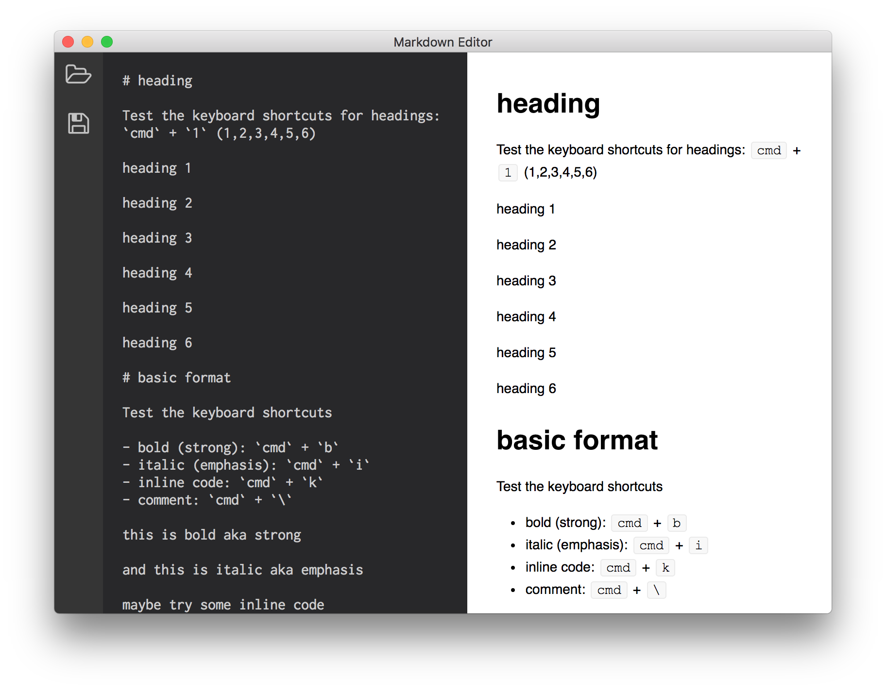

# hx markdown editor

I do a lot of writing in [markdown](http://daringfireball.net/projects/markdown/syntax) and I usually use [Macdown](http://macdown.uranusjr.com/) for that.

Besides that I also use my normal editors for it: VSCode and Sublime.

But wouldn't it be awesome to have that all in one?

That's the itch and this is how I scratch that!




## WIP

Almost everything is `wip` but this one is more.

Contribute if you like, I will update when I feel more itches.


## Improvement

I have looked at the editors that I use (for coding and writing)

- vscode
- sublime text
- macdown

And want to take the good parts and intergrate them:

- folder stucture ()
- edit more then one file (tabs)
- distraction free edit
- export to different files (html/pdf/rich text/etc)
- editor short cuts
- snippets


## Haxe

This is a [Haxe](http://www.haxe.org) project, read more about it in the [README_HAXE.MD](README_HAXE.MD)!


## Sources

I use [Haxe](https://haxe.org/) type definitions for [Electron](http://electron.atom.io/) from <https://github.com/fponticelli/hxelectron>


For the conversion of markdown to html I use haxe-markdown:  <https://github.com/dpeek/haxe-markdown>

but there are some differences with other convertes

- double space (`  `) doesn't create a next line
- nested list don't work
- comments (`<!-- xxx -->`) are generated in html

default preview css from macdown (like github.css)

Font-awesome

normalize.css

FileSaver.js

<!--

## Demo Application

Spin up the demo application to see electron in action:

```sh
## Make sure you have Electron installed (you only need to do this once)
npm install -g electron

## Clone repository
git clone https://github.com/fponticelli/hxelectron
cd hxelectron/

## Set the haxelib development directory
haxelib dev electron .

## Build and run the demo application
haxe build.hxml
electron bin/
```
-->

## Build

For automatic build

```
npm run watch
```

For electron test

```
npm run electron
```


## Info


**Markdown** is a plain text formatting syntax created by John Gruber, aiming to provide a easy-to-read and feasible markup. You can find the original Markdown syntax specification [here](http://daringfireball.net/projects/markdown/syntax).


**MacDown** is a simple-to-use editor for Markdown documents. It renders your Markdown contents real-time into HTML, and display them in a preview panel. You can download it [here](http://macdown.uranusjr.com/).


