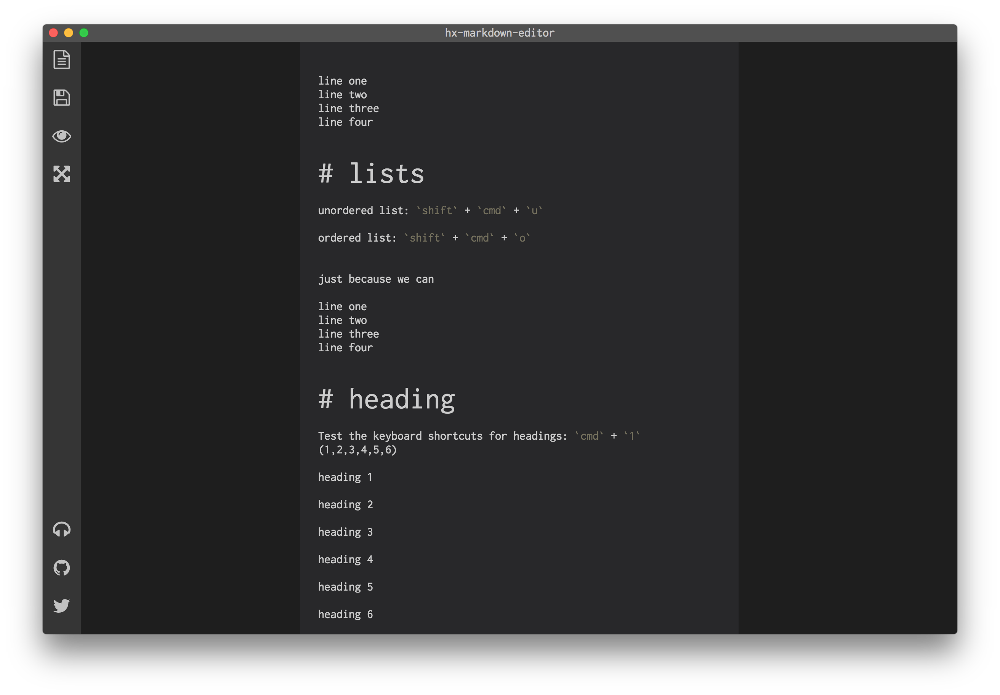

# hx markdown editor

I do a lot of writing in [markdown](http://daringfireball.net/projects/markdown/syntax) and I usually use [Macdown](http://macdown.uranusjr.com/) for that.

Besides that I also use my normal editors for it: VSCode and Sublime.

But wouldn't it be awesome to have that all in one?

That's the itch and this is how I scratch that!

## Screenshot




## WIP

Almost everything is `wip` but this one is more.

Contribute if you like, I will update when I feel more itches.

## Improvement

I have looked at the editors that I use (for coding and writing)

- vscode
- sublime text
- macdown

And want to take the good parts and intergrate them:

- [X] editor short cuts
- [X] Fullscreen editing
- [X] Status bar
- [X] Preview mode
- [X] distraction free edit
- [X] toggle preview
- [ ] subtle markdown styling (preview is full styling)
- [ ] edit more then one file (tabs)
- [ ] export to different files (html/pdf/rich text/etc)
- [ ] snippets
- [ ] Spell check
- [ ] folder stucture (might be usefull with a lot of files in one folder...)
- [ ] Windows support for Keymaps (can't test this, but might be usefull for others)


## Features

I stole this features from other (Markdown) editors, I think they make sence to have as well.
They are not as important as the previously mentioned

- [X] Read/Write/Preview mode
- [X] Focus mode
- [X] Live preview
- [x] Shortcuts (ctrl-S, Ctrl-O, etc) read the [shortcut list](/src/assets/shortcut.md)
- [x] Fullscreen (distraction-free) mode
- [X] Preview HTML
- [ ] GitHub Flavored Markdown
- [ ] Code highlight in preview
- [ ] Code highlight themes (powered by highlight.js)
- [ ] Auto reload
- [ ] Localization
- [ ] GitHub Flavored Markdown support
- [ ] Search in Markdown
- [ ] Syntax highlighting
- [ ] Emoji Support
- [ ] Words count
- [ ] Resizable panels
- [ ] Finder integration (OS X)
- [ ] Dialog for image
- [ ] Dialog for videos (mp4)
- [ ] Dialog for tables
- [ ] Multiple documents
- [ ] Allow drag’n’drop files onto app icon (Finder or Dock)
- [ ] Markdown & code block highlighting
- [ ] Find & replace
- [ ] Emoji support in preview 🎉
- [ ] Day & Night themes
- [ ] Copy HTML to clipboard
- [ ] Export HTML
- [ ] Export PDF
- [ ] Printing
- [ ] App will stay alive in tray for quick usage


## Technologies used

I use [Haxe](https://haxe.org/) type definitions for [Electron](http://electron.atom.io/) from <https://github.com/fponticelli/hxelectron>

- [Electron](http://electron.atom.io/)
- <https://codemirror.net/>
- Haxe externs for Codemirror: <https://github.com/clemos/try-haxe/tree/master/src/js/codemirror>

- default preview css from macdown (like github.css)
- <http://fontawesome.io/>
- normalize.css
- FileSaver.js

**markdown**

- ~~For the conversion of markdown to html I use haxe-markdown:  <https://github.com/dpeek/haxe-markdown>~~
- https://github.com/markdown-it/markdown-it
- https://github.com/chjj/marked


## Haxe

This is a [Haxe](http://www.haxe.org) project, read more about it in the [README_HAXE.MD](README_HAXE.MD)!


<!--

## Demo Application

Spin up the demo application to see electron in action:

```sh
## Make sure you have Electron installed (you only need to do this once)
npm install -g electron

## Clone repository
git clone https://github.com/fponticelli/hxelectron
cd hxelectron/

## Set the haxelib development directory
haxelib dev electron .

## Build and run the demo application
haxe build.hxml
electron bin/
```
-->

## Build

For automatic build

```
npm run watch
```

For electron test

```
npm run electron
```


## Info


**Markdown** is a plain text formatting syntax created by John Gruber, aiming to provide a easy-to-read and feasible markup. You can find the original Markdown syntax specification [here](http://daringfireball.net/projects/markdown/syntax).


**MacDown** is a simple-to-use editor for Markdown documents. It renders your Markdown contents real-time into HTML, and display them in a preview panel. You can download it [here](http://macdown.uranusjr.com/).


